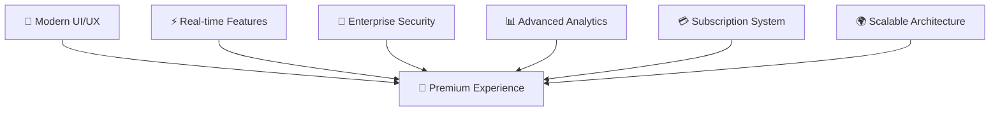
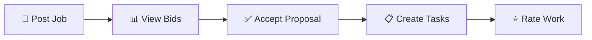
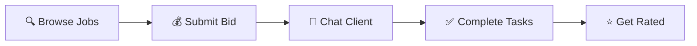
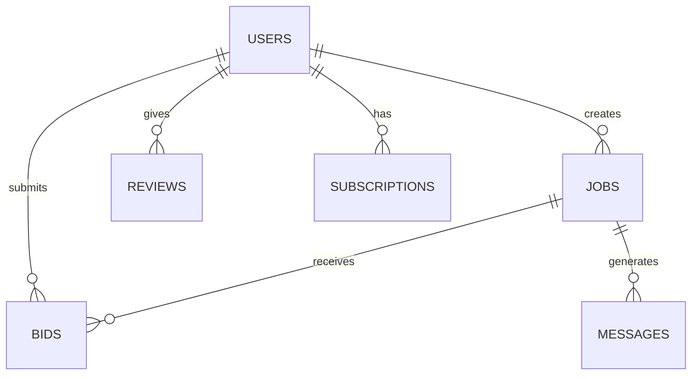

<div align="center">

# 🚀 FreelanceHub - Next-Gen SaaS Marketplace


**🌟 Where Exceptional Talent Meets Extraordinary Opportunities 🌟**

*Crafted with passion by [Ahsan Khizar](https://github.com/ahsankhizar5)*

[](https://nextjs.org/)
[](https://www.typescriptlang.org/)
[](https://supabase.com/)
[](https://tailwindcss.com/)
[](https://reactjs.org/)

---

</div>

## 🎯 **Project Overview**

> **"Revolutionizing the freelance ecosystem with cutting-edge technology"** - Ahsan Khizar

FreelanceHub is not just another marketplace—it's a **comprehensive SaaS ecosystem** that transforms how businesses and freelancers collaborate. Built from the ground up with modern architecture, this platform represents the pinnacle of full-stack development expertise.

### 🏆 **What Makes This Special?**



## ✨ **Feature Galaxy**

<details>
<summary><b>🚀 Core Platform Engine</b></summary>

- **🎭 Multi-Role Authentication** - Sophisticated admin/freelancer ecosystem
- **📋 Intelligent Job Management** - Smart matching algorithms
- **💼 Dynamic Bidding System** - Real-time proposal marketplace  
- **💬 Live Messaging Hub** - WebSocket-powered communications
- **📊 Kanban Task Tracking** - Visual project management
- **⭐ Reputation System** - Trust-building through reviews
- **💎 Premium Subscriptions** - Tiered feature access control

</details>

<details>
<summary><b>🎨 Design & User Experience</b></summary>

- **🌈 Professional Green Palette** - Psychology-driven color scheme
- **📱 Mobile-First Responsive** - Pixel-perfect across all devices  
- **🎯 shadcn/ui Components** - Enterprise-grade UI library
- **🌙 Dark Mode Mastery** - Seamless theme switching
- **⚡ Performance Optimized** - Lightning-fast load times

</details>

<details>
<summary><b>🏢 Business Intelligence Suite</b></summary>

- **📈 Real-time Analytics** - Revenue tracking & insights dashboard
- **👥 Community Platform** - Forums, knowledge base, success stories
- **🎯 Marketing Engine** - Complete funnel with landing pages
- **🛠 Admin Command Center** - Comprehensive platform control
- **📊 Performance Metrics** - Advanced business intelligence

</details>

## 🛠 **Technical Architecture**

<table>
<tr>
<td width="50%">

### 🎯 **Frontend Mastery**
```typescript
⚡ Next.js 14 (App Router)
🔷 TypeScript (100% Coverage)  
🎨 Tailwind CSS v4
🧩 React 19 (Latest)
📱 Responsive Design
🎭 shadcn/ui + Radix UI
```

</td>
<td width="50%">

### ⚙️ **Backend Excellence**  
```sql
🗄️ Supabase PostgreSQL
🔐 Row Level Security (RLS)
🔑 Multi-role Authentication  
📊 Real-time Subscriptions
🚀 Edge Functions
📈 Advanced Analytics
```

</td>
</tr>
</table>

## 🚀 **Lightning-Fast Setup**

### Prerequisites Checklist
- ✅ Node.js 18+ 
- ✅ npm/yarn package manager
- ✅ Supabase account (free tier available)

### 🎬 **Quick Start (5 Minutes!)**

```bash
# 🎯 Step 1: Project Setup
git clone https://github.com/ahsankhizar5/Private-Freelance-Marketplace-SaaS.git
cd Private-Freelance-Marketplace-SaaS
npm install

# 🔧 Step 2: Environment Configuration
cp .env.example .env.local
# Add your Supabase credentials

# 🚀 Step 3: Launch
npm run dev
```

<div align="center">

**🌟 Your FreelanceHub is now running at [localhost:3000](http://localhost:3000) 🌟**

</div>

### 🗄️ **Database Magic**

Execute these SQL scripts in your Supabase dashboard:

```sql
-- 🏗️ Foundation Schema
📄 scripts/01-create-database-schema.sql

-- ⭐ Ratings System  
📄 scripts/02-complete-job-and-enable-ratings.sql

-- 💎 Subscription Engine
📄 scripts/03-add-subscription-tables.sql  

-- 👥 Community Features
📄 scripts/04-add-community-tables.sql
```

## 📂 **Project Architecture**

```
🏗️ FreelanceHub Structure
├── 🎭 app/                    # Next.js App Router
│   ├── 👑 admin/             # Admin Control Center
│   ├── 💼 freelancer/        # Freelancer Dashboard  
│   ├── 🔐 auth/              # Authentication Flow
│   ├── 👥 community/         # Social Features
│   ├── 🏠 workroom/          # Task Management
│   └── 💬 messages/          # Real-time Chat
├── 🧩 components/            # Reusable UI Magic
│   ├── 🔒 auth/              # Login/Signup Forms
│   ├── 📋 jobs/              # Job Management
│   ├── ✅ tasks/             # Project Tracking
│   ├── 💬 messaging/         # Chat Interface
│   ├── ⭐ reviews/           # Rating System
│   ├── 💎 premium/           # Subscription UI
│   ├── 📊 analytics/         # Data Visualization
│   └── 🎨 landing/           # Marketing Pages
├── 📚 lib/                   # Utilities & Config
│   └── 🗄️ supabase/          # Database Client
└── 📄 scripts/               # SQL Migrations
```

## 🎯 **Key User Journeys**

<table>
<tr>
<th>👑 Admin Experience</th>
<th>💼 Freelancer Experience</th>
</tr>
<tr>
<td>



</td>
<td>



</td>
</tr>
</table>

## 📊 **Database Schema Mastery**

Our **15+ interconnected tables** create a robust data ecosystem:



## 🚀 **Deployment Options**

<div align="center">

| Platform | Setup Time | Difficulty | Recommendation |
|----------|------------|------------|----------------|
| **Vercel** | ⚡ 5 mins | 🟢 Easy | ⭐⭐⭐⭐⭐ |
| **Netlify** | ⚡ 10 mins | 🟢 Easy | ⭐⭐⭐⭐ |
| **Railway** | ⚡ 15 mins | 🟡 Medium | ⭐⭐⭐ |
| **DigitalOcean** | ⚡ 30 mins | 🔴 Advanced | ⭐⭐⭐⭐ |

</div>

### 🎯 **One-Click Vercel Deploy**

[](https://vercel.com/new/clone?repository-url=https://github.com/ahsankhizar5/Private-Freelance-Marketplace-SaaS)

## 👨‍💻 **Meet The Developer**

<div align="center">


### **Ahsan Khizar** 
*Full-Stack SaaS Architect & Innovation Engineer*

[](https://github.com/ahsankhizar5)
[](https://linkedin.com/in/ahsankhizar5)

</div>

### 🎯 **Developer Expertise Showcase**

```typescript
const ahsanKhizar = {
  expertise: ["Next.js", "React", "TypeScript", "Supabase", "PostgreSQL"],
  specialization: "SaaS Platform Development",
  experience: "Enterprise-Grade Applications",
  passion: "Transforming Ideas into Digital Reality",
  philosophy: "Code with Purpose, Design with Empathy"
}
```

### 🏆 **Technical Achievements in This Project**

<div align="center">

| 🎯 Feature | 📊 Complexity | ⭐ Innovation Level |
|------------|---------------|-------------------|
| **Real-time Chat System** | 🔴 Advanced | ⭐⭐⭐⭐⭐ |
| **Multi-tenant Architecture** | 🔴 Advanced | ⭐⭐⭐⭐⭐ |
| **Dynamic Subscription Engine** | 🔴 Advanced | ⭐⭐⭐⭐ |
| **Role-based Security (RLS)** | 🔴 Advanced | ⭐⭐⭐⭐⭐ |
| **Real-time Analytics** | 🟡 Medium | ⭐⭐⭐⭐ |

</div>

## 🤝 **Contributing & Community**

We welcome contributions from the community! Here's how you can be part of this amazing project:

```bash
# 🍴 Fork the repository
# 🌿 Create your feature branch
git checkout -b feature/amazing-feature

# ✨ Make your changes
git commit -m "Add amazing feature"

# 🚀 Push to your branch  
git push origin feature/amazing-feature

# 📝 Open a Pull Request
```

### 🎯 **Contribution Guidelines**

- ✅ Follow TypeScript best practices
- ✅ Maintain component architecture patterns
- ✅ Add tests for new features
- ✅ Update documentation
- ✅ Ensure responsive design

## 📞 **Support & Contact**

<div align="center">

### 🆘 **Need Help?**

| Type | Contact Method |
|------|---------------|
| 🐛 **Bug Reports** | [GitHub Issues](https://github.com/ahsankhizar5/Private-Freelance-Marketplace-SaaS/issues) |
| 💡 **Feature Requests** | [GitHub Discussions](https://github.com/ahsankhizar5/Private-Freelance-Marketplace-SaaS/discussions) |
| 🤝 **Professional Inquiries** | [LinkedIn DM](https://linkedin.com/in/ahsankhizar5) |
| 📧 **Direct Contact** | Available on GitHub Profile |

</div>

## 📜 **License & Rights**

```
Copyright © 2024 Ahsan Khizar. All Rights Reserved.

This project is proprietary and confidential.
Unauthorized copying, distribution, or use is strictly prohibited.
```

---

<div align="center">

## 🌟 **Project Stats**


### 💎 **Built with Excellence by Ahsan Khizar**

*"Where code meets creativity, and innovation becomes reality"*


---

**🚀 Star this repository if you found it helpful!**

</div>
